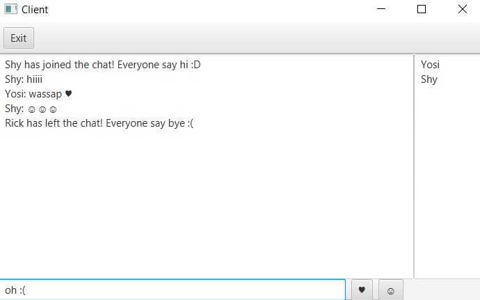

# JavaSimpleChatRoom  
## About  
This is a simple Chat Room Java application, demonstrating:  

- Socket Streams (IPv4, TCP)  
- Multi-threading  
- JavaFX & FXML  

  

## Project Structure  
The project is split into two applications:  
- **Server**  
- **Client**  

## How to Run  
1. First, run (or **compile & run**) the **server** side.  
2. Then, run (or **compile & run**) the **client** side.  

## How to Join the Chat Room  
Follow the guide in the **Client-side GUI**.  

Enjoy! 😃  
